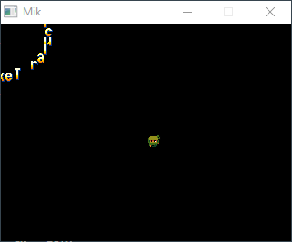

.. _GettingStarted:

Getting Started
---------------

Mikro (pronounced `mee-cro`), is a really simple game platform/engine
intended for `small` games (you could make big ones too).

It uses Lua scripting for the games and it's implemented in C++ for that `full speed`.
It supports some basic shapes, sprites, animations, simple sounds and music, and everything is
limited to a 320x240 screen, upscaled to a 640x480 window.

You can get Mikro `here <https://github.com/DCubix/Mikro>`__.

For you to run any game, just drag your Lua script to the executable and done.
Here's a simple "Hello World program":

    .. code-block:: lua

        local x = 0.0
        function _init()
            print("Hello World Started!")
        end

        function _draw()
            mik.clear(128, 80, 20)
            mik.line(0, 0, 100, 100,  255, 255, 0)
            mik.circf(x, 100, 12,  0, 255, 255)
        end

        function _update(dt)
            x = x + dt
        end

        function _exit()
            print("Hello World Finished!")
        end

Now check out the :ref:`api` page to learn more about all the functionality.

Gallery
"""""""

.. image:: mik_demo6.gif